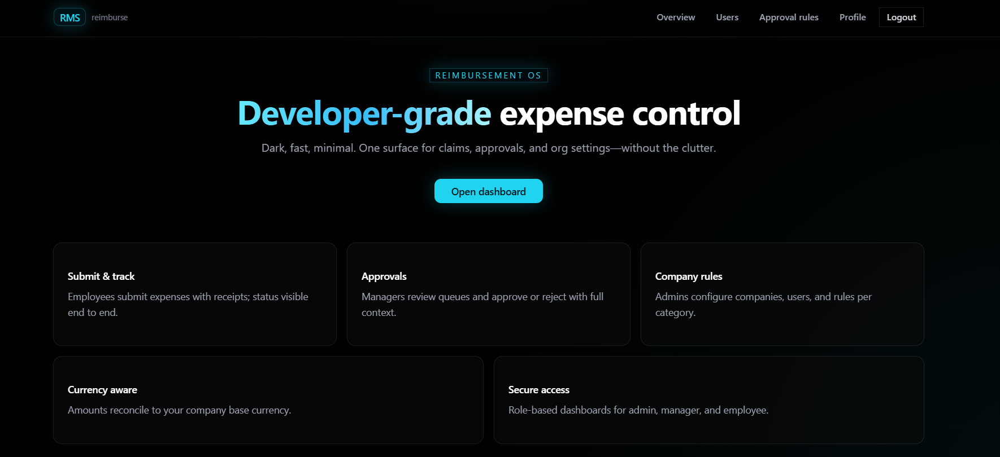
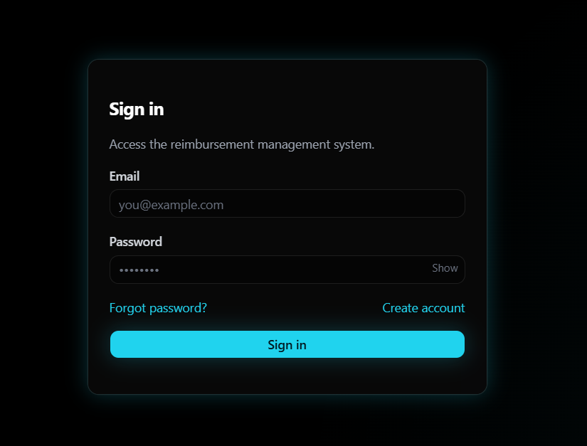
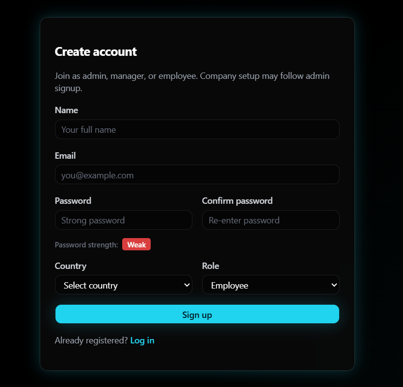
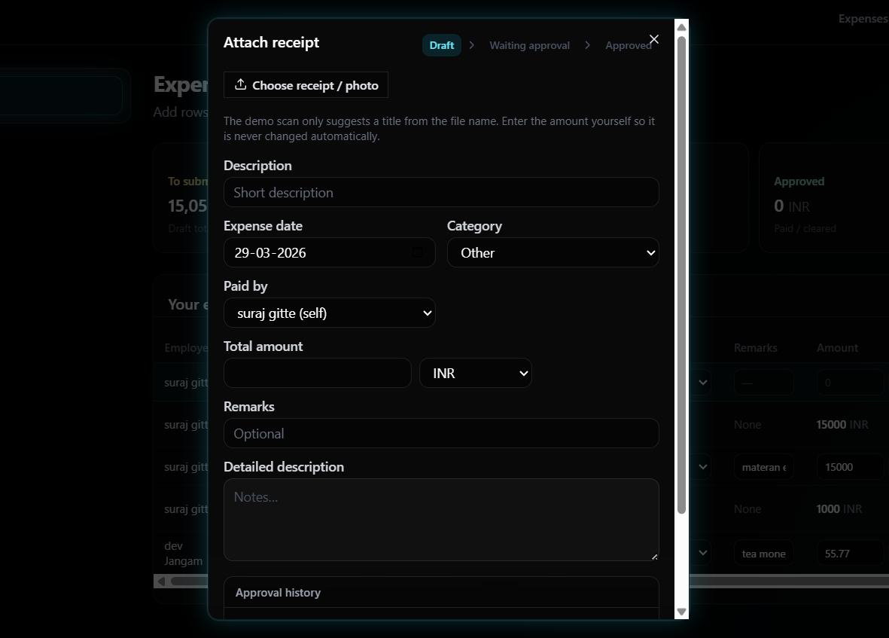
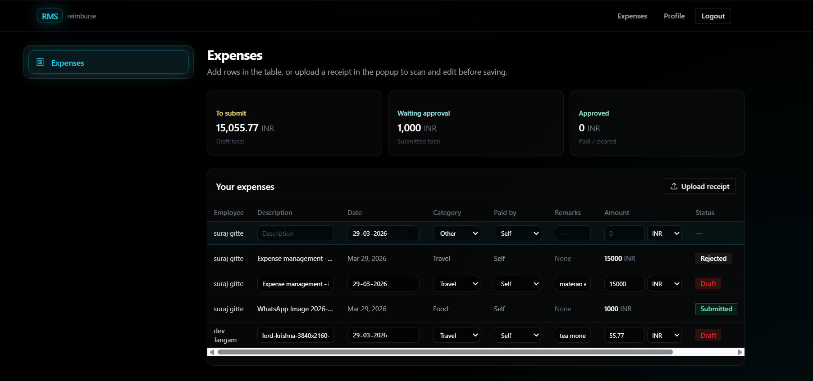
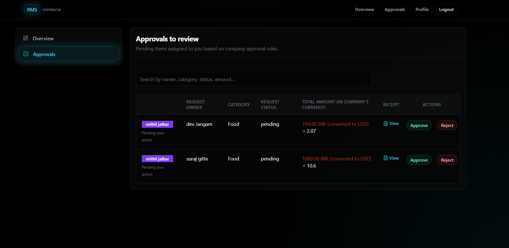
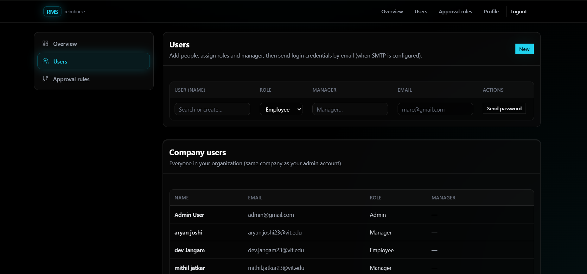
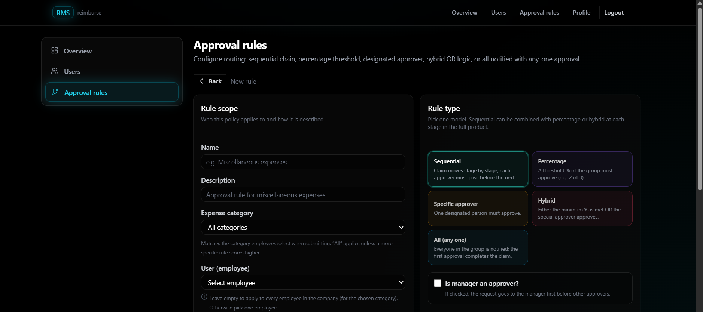

# ReimburseIt - Expense Reimbursement Platform

A modern multi-role expense reimbursement platform built for the Hackathon, featuring configurable multi-level approval workflows, OCR receipt scanning, multi-currency support, and role-based dashboards.

## Features

- User Authentication & Authorization (JWT + bcrypt)
- Auto Company & Admin Creation on Signup
- Multi-Currency Expense Submission with Live FX Conversion
- OCR Receipt Scanning (Gemini Vision API — auto-fills expense fields)
- Configurable Multi-Level Approval Workflows
- Conditional Approval Rules (Sequential, Percentage, Specific, Hybrid)
- Admin Dashboard (Users, Rules, All Expenses, Override)
- Manager Approval Queue with Approval Timeline
- Email Notifications on Approval / Rejection
- Responsive Design
- Modern UI with Tailwind CSS + shadcn/ui

## Prerequisites

- Node.js (v18 or higher)
- MySQL 8+
- npm or yarn
- Gemini API key (for OCR)
- Gmail app password (for email notifications)

## Quick Start

### 1. Clone & Install Dependencies

```bash
git clone https://github.com/your-username/reimburse-it.git
cd reimburse-it

# Install backend dependencies
cd backend && npm install

# Install frontend dependencies
cd ../frontend && npm install
```

### 2. Set Up Database

```bash
mysql -u root -p
CREATE DATABASE reimbursement_db;
```

Then run the migration scripts in order:

```bash
cd backend
npm run migrate
```

### 3. Set Up Environment

```bash
# Backend
cd backend
cp .env.example .env
```

Edit `backend/.env`:

```env
PORT=5000

DB_HOST=localhost
DB_PORT=3306
DB_USER=root
DB_PASSWORD=yourpassword
DB_NAME=reimbursement_db

JWT_SECRET=your_super_secret_key
JWT_EXPIRES_IN=7d

GEMINI_API_KEY=your_gemini_api_key

EMAIL_HOST=smtp.gmail.com
EMAIL_PORT=587
EMAIL_USER=yourapp@gmail.com
EMAIL_PASS=your_app_password

FRONTEND_URL=http://localhost:5173
```

```bash
# Frontend
cd frontend
cp .env.example .env
```

Edit `frontend/.env`:

```env
VITE_API_BASE_URL=http://localhost:5000
```

### 4. Start the Application

```bash
# Terminal 1 — Start backend
cd backend && npm run dev

# Terminal 2 — Start frontend
cd frontend && npm run dev
```

### 5. Access the Application

- **Frontend**: http://localhost:5173
- **Backend API**: http://localhost:5000
- **Health Check**: http://localhost:5000/ping

> **First signup** automatically creates a Company (using your selected country's currency) and an Admin account. No seed script needed.

---

## Screenshots & Demo

### Application Demo Video


### Homepage



### Authentication




### Employee — Expense Submission



### Employee — Approval Timeline



### Manager — Approval Dashboard



### Admin — Dashboard




---

## Project Structure

```
reimburse-it/
├── backend/
│   ├── server.js               # Entry point
│   ├── config/
│   │   └── db.js               # MySQL connection pool
│   ├── middleware/
│   │   ├── auth.js             # JWT verify, attach req.user
│   │   └── role.js             # roleMiddleware(["admin","manager"])
│   ├── routes/
│   │   ├── auth.js             # /api/auth/*
│   │   ├── users.js            # /api/users/*
│   │   ├── rules.js            # /api/rules/*
│   │   ├── expenses.js         # /api/expenses/*
│   │   └── ocr.js              # /api/ocr
│   ├── services/
│   │   ├── approvalEngine.js   # Core workflow logic
│   │   ├── currencyService.js  # FX conversion
│   │   └── emailService.js     # nodemailer notifications
│   └── uploads/                # Temp receipt images
│
├── frontend/
│   └── src/
│       ├── App.jsx             # Routes + ProtectedRoute
│       ├── context/
│       │   └── AuthContext.jsx # JWT state, login/logout
│       ├── services/           # All API calls — no fetch in UI
│       │   ├── expenseService.js
│       │   ├── userService.js
│       │   └── useOCR.js
│       ├── Pages/
│       │   ├── Auth/           # Login, Signup, ForgotPassword
│       │   ├── User/           # SubmitExpense, ExpenseList, ExpenseDetail
│       │   ├── MiddlePerson/   # ApprovalDashboard
│       │   └── Admin/          # AddUser, CreateCompany
│       └── components/
│           ├── ApprovalTimeline.jsx
│           ├── ExpenseStatusBadge.jsx
│           ├── CurrencySelect.jsx
│           ├── ReceiptUploader.jsx
│           └── RuleBuilder.jsx
│
└── package.json
```

---

## API Endpoints

### Authentication

- `POST /api/auth/signup` — Register + auto-create company and admin
- `POST /api/auth/login` — Login, returns JWT
- `POST /api/auth/forgot-password` — Send temp password via email
- `POST /api/auth/change-password` — Change password (JWT required)

### User Management (Admin)

- `GET /api/users` — List all users in company
- `POST /api/users` — Create employee or manager
- `PATCH /api/users/:id/role` — Change user role
- `PATCH /api/users/:id/manager` — Reassign manager

### Approval Rules (Admin)

- `GET /api/rules` — All rules for company
- `POST /api/rules` — Create rule with approver sequence
- `PUT /api/rules/:id` — Update rule
- `DELETE /api/rules/:id` — Delete rule

### Expenses

- `GET /api/expenses` — Scoped by role (own / team / all)
- `POST /api/expenses` — Submit new expense
- `GET /api/expenses/:id` — Detail + approval timeline
- `POST /api/expenses/:id/approve` — Approve (Manager/Admin)
- `POST /api/expenses/:id/reject` — Reject with comment (Manager/Admin)
- `GET /api/expenses/pending` — Queue for current manager
- `POST /api/expenses/:id/override` — Force decision (Admin only)

### OCR

- `POST /api/ocr` — Upload receipt image → returns `{amount, currency, date, description, category, merchant_name}`

---

## Roles & Permissions

| Role | Key Capabilities |
|------|-----------------|
| **Admin** | Auto-created on signup. Manages users, roles, approval rules. Views all expenses. Can override approvals at any time. |
| **Manager** | Views pending approval queue (amounts in company currency). Approves or rejects with comments. |
| **Employee** | Submits expenses in any currency with optional OCR. Tracks own history and approval status. |

---

## Approval Engine

Rules are configured **per expense category**. The engine supports four rule types:

| Rule Type | Satisfied When |
|-----------|---------------|
| `sequential` | Every approver in sequence has approved |
| `percentage` | (Approved ÷ Total) × 100 ≥ threshold |
| `specific` | The designated golden approver has approved |
| `hybrid` | Percentage condition **or** golden approver — whichever fires first |

- If `is_manager_approver` is enabled on a rule, the submitter's direct manager is automatically inserted as **Step 0**.
- The submitter is always filtered from the approver list — no self-approvals.
- Any single rejection immediately closes the expense.
- Admin can override any expense at any time, bypassing rules.

---

## Admin Features

Once logged in as admin you can:

1. **Manage Users** — Create employees and managers, assign roles, reassign manager relationships
2. **Configure Approval Rules** — Create rules per expense category with drag-to-reorder approver sequences
3. **View All Expenses** — Filter by status, category, user, or date range
4. **Override Approvals** — Force approve or reject any expense, bypassing the configured rule
5. **Monitor Timelines** — View full approval audit trail per expense

---

## Troubleshooting

### Common Issues

1. **Port already in use** — Change `PORT` in `backend/.env`
2. **MySQL connection failed** — Check `DB_HOST`, `DB_USER`, `DB_PASSWORD` in `.env`
3. **CORS errors** — Ensure `FRONTEND_URL` in backend `.env` matches your frontend port
4. **OCR not working** — Verify `GEMINI_API_KEY` is valid and has Vision API access
5. **Emails not sending** — Use a Gmail App Password (not your account password); enable 2FA first

### Logs

- **Server logs** — Terminal running the backend
- **Client logs** — Browser console (F12)
- **Database logs** — MySQL error log

---

## Contributing

1. Fork the repository
2. Create a feature branch (`git checkout -b feature/your-feature`)
3. Make your changes
4. Test thoroughly
5. Submit a pull request

---

## License

This project is licensed under the ISC License.
